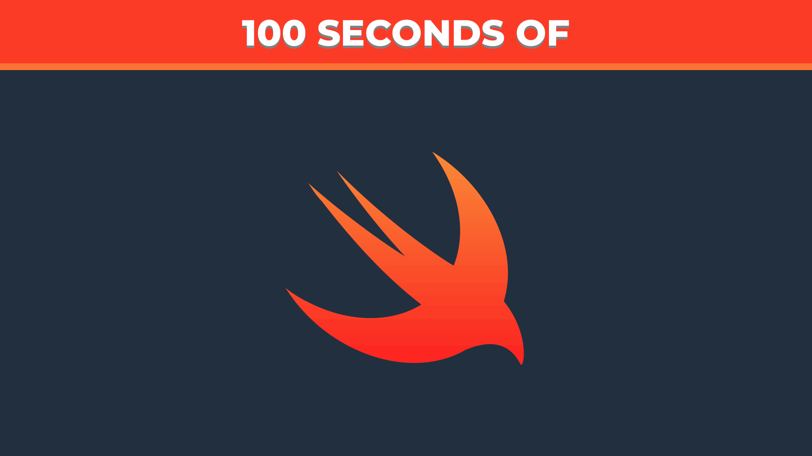
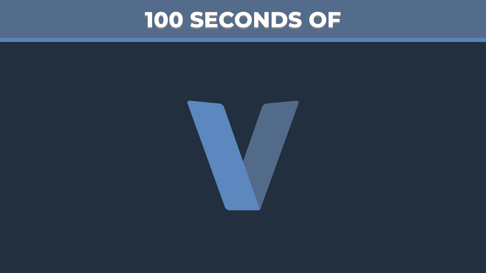

# Hundred

Do you like [Fireship's](https://www.youtube.com/c/Fireship) "100 Seconds of Code" videos? This project is
**an attempt** at creating those videos automatically, so you can watch as many as you want about whatever topic you
want.

## Examples

### Thumbnail Generation

### Video Script Generation: Work in Progress

### Video Generation: Not Started

## Develop

1. Clone this repository
2. Install the requirements (recommended: in a virtual environment)
3. Run `python -m hundred information.ini`
